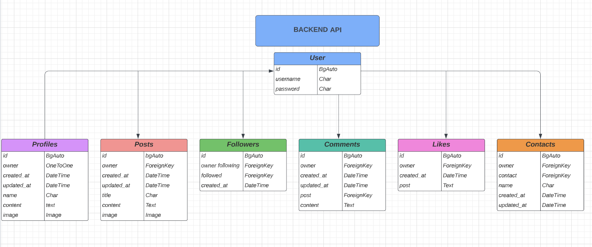

# API - Social Media

## Project Goals

* Design an interactive Front-End web application using HTML, CSS 

This repository is the backend of the application using the Django REST Framework(DRF) holding the API database for the front end part of the application.

## Technologies and Libraries

### Language used

*Python - The Django REST Framework 

### Frameworks, libraries and programs

* Cloudinary Storage
  * storage of images
* Pillow
  * image processing capabillities
* Psycopg2
  * PostgreSQL database adapter for python
* JSON web tokens
  * Http-safety, web-tokens for kepping user logged in, authentication etc.
* Git
  * version control, committing and pushing to Github
* Github
  * storing the repository, files and images
* Gitpod
  * IDE used to code project
* Heroku
  * used to deploy the application
* Django rest auth
* PostgreSQL
* Cors headers

## Initial plan

This project was planned in the begining as a Diary page, but it was switched to follow the walkthrough from the lessons on Rest-framework and React.

## Plan 

The current plan now for the website/app is to follow the walkthrough by Code institute. 

## LucidChart

## User Goals

