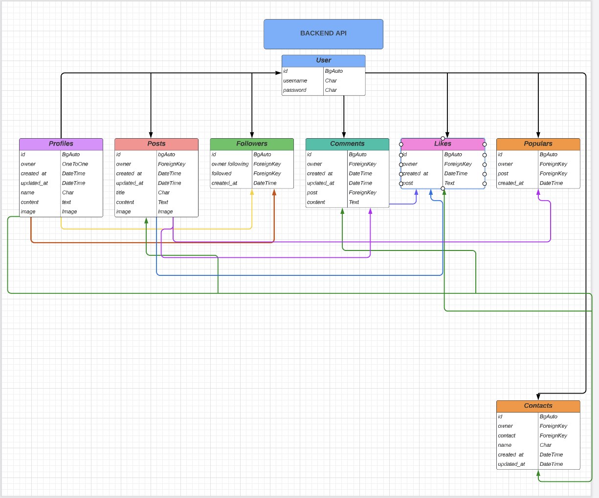

# THE SPACE - API - Social Media

## ABOUT:

The space is a online blog, social media platford where users can create a profile and post their images along with a title and content. Users can also view other users profiles, comment, like and favourite them.

[Deployed API heroku Link](https://drf-p5.herokuapp.com/)

[Deployed FRONT-END heroku Link](https://thespace.herokuapp.com/) : LIVE SITE

[Depoloyed Frontend Github Respository](https://github.com/EmmaRubiH/thespace)

## Project

This repository is the backend of the application using the Django REST Framework(DRF) holding the API database for the front end part of the application.

## Technologies and Libraries

### Language used

*Python - The Django REST Framework 

### Frameworks, libraries and programs

* Cloudinary Storage
  * storage of images
* Pillow
  * image processing capabillities
* Psycopg2
  * PostgreSQL database adapter for python
* JSON web tokens
  * Http-safety, web-tokens for kepping user logged in, authentication etc.
* Git
  * version control, committing and pushing to Github
* Github
  * storing the repository, files and images
* Gitpod
  * IDE used to code project
* Heroku
  * used to deploy the application
* Django rest auth
* PostgreSQL
* Cors headers

## Initial plan

This project was planned in the begining as a Diary page, but it was switched to follow the walkthrough from the lessons on Rest-framework and React.

## Plan 

The current direction for this project is to follow the walkthrough given by Code Institute and add two unique models. These are popular and Contacts in contacts. popular model (to store the most liked posts) contact(to contact another user).

## LucidChart

## User Goals

### User Goals:

* As a site user I can register an account
* As a site user I can delete my account
* As a site user I can create posts
* As a Site User I can Edit and Delete that Post at want
* As a Site User I can Follow and Unfollow other Users
* As a Site User I can Comment on other Users Posts
* As a Site User I can Edit and Delete the Comment I own
* As a Site User I can Like and Unlike Posts from other Users Posts

- I did this in the begining, so the Site user stories for popular and contact is not made in issues and project.

# Testing:

I tested the API manually to ensure everything was working for my project.

* When testing my superuser administrator in my back-end I can confirm all data entered from the front end is displaying!

* checking that search feature returns correct
* Manually verified each url path created to confirm they work and open without error
* Testing that the CRUD functionality is available in: User, Post, Profile, Comments, Followers, Likes, Populars.
* testing errors (details: not found) is working.
* Creating a new item with url path
* testing if editing a post and deleting a item works.

## CI Python linter

This site was tested with CI python linter.
No bugs detected.

## Bugs:
Could not get the frontend and backend to sync (with the posts). It was a spelling mistake. hade write post (so forgot the s). 

# Deployment:
Create the project

The steps, view here:

- Create GitHub repository.
- Create project app on Heroku.
- Add Postgres package to the Heroku app via Resources tab.
- Installe the following packages using the pip install command:

'django<4' dj3-cloudinary-storage Pillow djangorestframework django-filter dj-rest-auth 'dj-rest-auth[with_social]' djangorestframework-simplejwt dj_database_url psycopg2 gunicorn django-cors-headers

- Created the Django project with command:
django-admin startproject project_name .

- In Heroku, Settings tab, add configvars:
Key: SECRET_KEY | Value: hidden Key: CLOUDINARY_URL | Value: cloudinary://hidden Key: DISABLE_COLLECTSTATIC | Value: 1 Key: ALLOWED_HOST | Value: api-app-name.herokuapp.com

- Once the ReactApp is created, add configvars: (Check that the trailing slash \ at the end of both links has been removed.)

Key: CLIENT_ORIGIN | Value: Heroku app link Key: CLIENT_ORIGIN_DEV | Value: Gitpod link

- Created env.py file and add variables.
import os

os.environ['CLOUDINARY_URL'] = 'cloudinary://hidden' os.environ['DEV'] = '1' os.environ['SECRET_KEY'] = 'hidden' os.environ['DATABASE_URL'] = 'postgres://hidden'

IN SETTINGS.PY
- Add to INSTALLED_APPS to support the newly installed packages:
'cloudinary_storage', 'django.contrib.staticfiles', 'cloudinary', 'rest_framework', 'django_filters', 'rest_framework.authtoken', 'dj_rest_auth', 'django.contrib.sites', 'allauth', 'allauth.account', 'allauth.socialaccount', 'dj_rest_auth.registration', 'corsheaders',
- Import the database, regular expression module and the env.py

import dj_database_url import re import os if os.path.exists('env.py') import env

- Below import statements, add variable for Cloudinary:
CLOUDINARY_STORAGE = { 'CLOUDINARY_URL': os.environ.ger('CLOUDINARY_URL') }

MEDIA_URL = '/media/' DEFAULT_FILE_STORAGE = 'cloudinary_storage.storage.MediaCloudinartStorage'

- Below INSTALLED_APPS, set site ID:
SITE_ID = 1 Below BASE_DIR, create the REST_FRAMEWORK, and include page pagination to improve app loading times, pagination count, and date/time format: REST_FRAMEWORK = { 'DEFAULT_AUTHENTICATION_CLASSES': [( 'rest_framework.authentication.SessionAuthentication' if 'DEV' in os.environ else 'dj_rest_auth.jwt_auth.JWTCookieAuthentication' )], 'DEFAULT_PAGINATION_CLASS': 'rest_framework.pagination.PageNumberPagination', 'PAGE_SIZE': 10, 'DATETIME_FORMAT': '%d %b %Y', }

- Set the default renderer to JSON:
if 'DEV' not in os.environ: REST_FRAMEWORK['DEFAULT_RENDERER_CLASSES'] = [ 'rest_framework.renderers.JSONRenderer', ]

- Under this, add:

REST_USE_JWT = True JWT_AUTH_SECURE = True JWT_AUTH_COOKIE = 'my-app-auth' JWT_AUTH_REFRESH_COOKIE = 'my-refresh-token' JWT_AUTH_SAMESITE = 'None'

- REST_AUTH_SERIALIZERS = { 'USER_DETAILS_SERIALIZER': 'project_name.serializers.CurrentUserSerializer' }
- Updated DEBUG:
DEBUG = 'DEV' in os.environ
- Updated the DATABASES variable:
DATABASES = { 'default': ({ 'ENGINE': 'django.db.backends.sqlite3', 'NAME': BASE_DIR / 'db.sqlite3', } if 'DEV' in os.environ else dj_database_url.parse( os.environ.get('DATABASE_URL') ) ) }

- Added the Heroku app to ALLOWED_HOSTS variable:
os.environ.get('ALLOWED_HOST'), 'localhost',

- Below ALLOWED_HOST, add CORS_ALLOWED variable:
if 'CLIENT_ORIGIN' in os.environ: CORS_ALLOWED_ORIGINS = [ os.environ.get('CLIENT_ORIGIN') ]

if 'CLIENT_ORIGIN_DEV' in os.environ: extracted_url = re.match(r'^.+-', os.environ.get('CLIENT_ORIGIN_DEV', ''), re.IGNORECASE).group(0) CORS_ALLOWED_ORIGIN_REGEXES = [ rf"{extracted_url}(eu|us)\d+\w.gitpod.io$", ]

- Add to top of MIDDLEWARE:
'corsheaders.middleware.CorsMiddleware',
- Created a Procfile and add: release: python manage.py makemigrations && python manage.py migrate web: gunicorn project_name.wsgi
- Migrated the database:

python3 manage.py makemigrations python3 manage.py migrate

- Freeze requirements:
pip3 freeze --local > requirements.txt

- Add, commit, push the changes to GitHub
- Navigated back to heroku, and under the ‘Deploy’ tab, connect the GitHub repository.
- Deployed the branch.

# Credits

## Media:

images is the same from the drf walkthrough project.

## Content:

* The biggest credit has to go Code Institute, I followed the Walkthroughs given, and developed a little on top of it.
* Thanks to my mentor jubril and the slack-channel.

